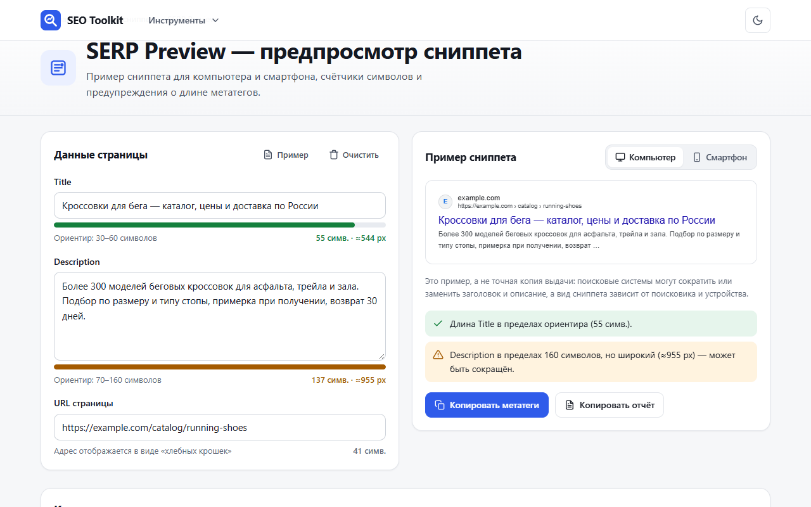
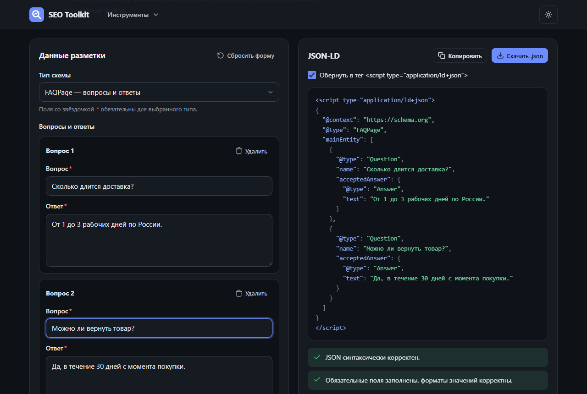
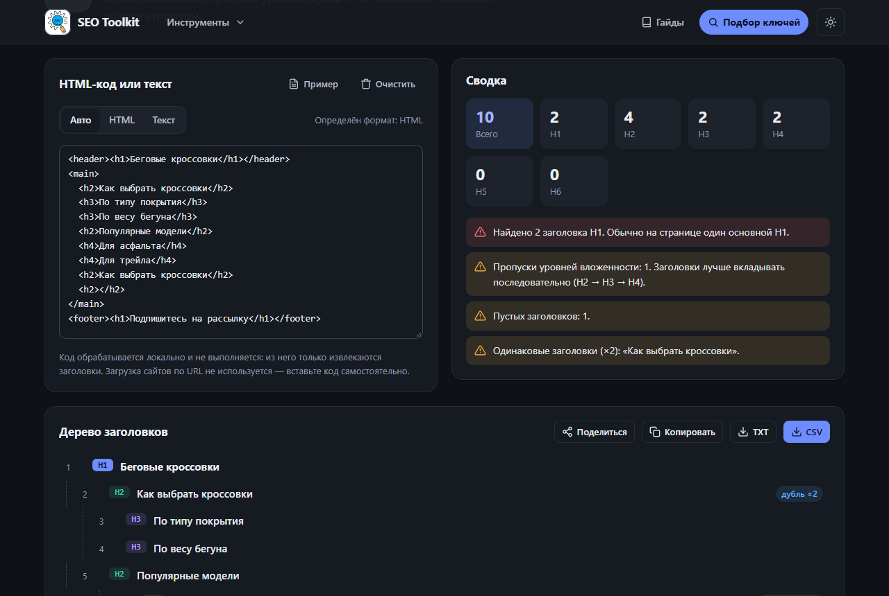
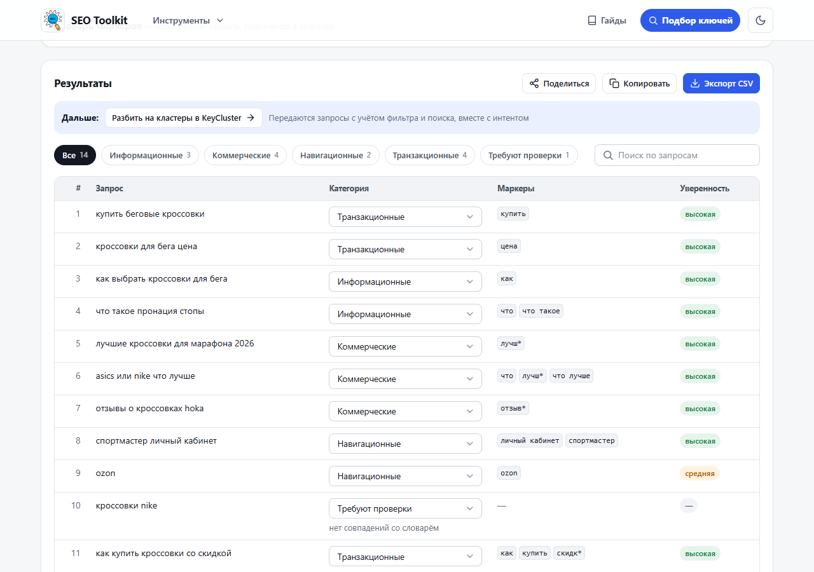
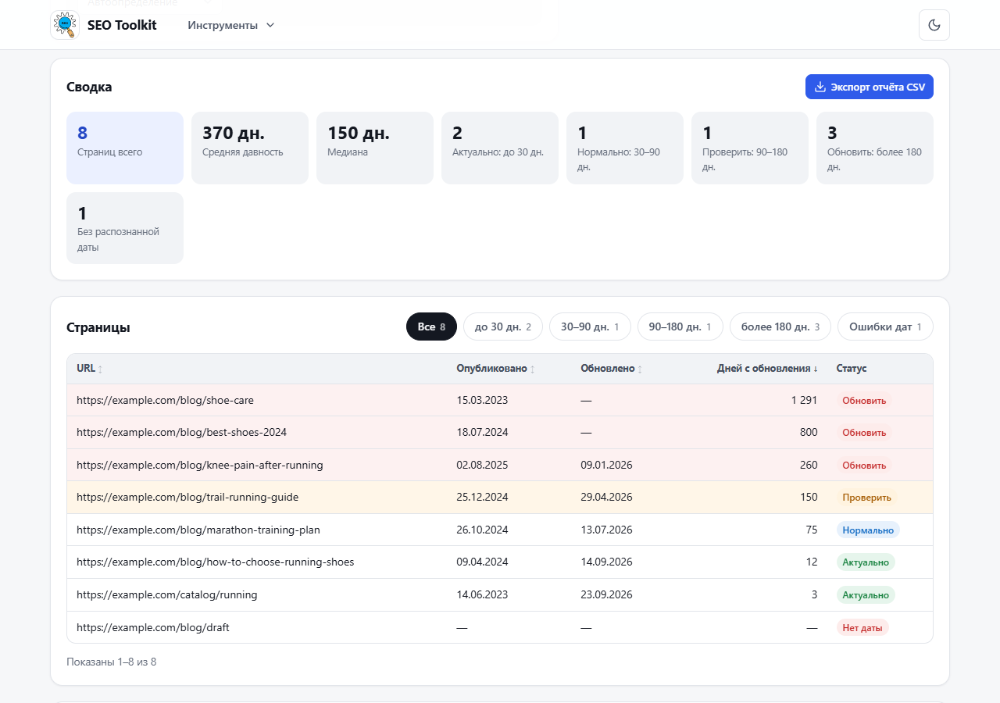
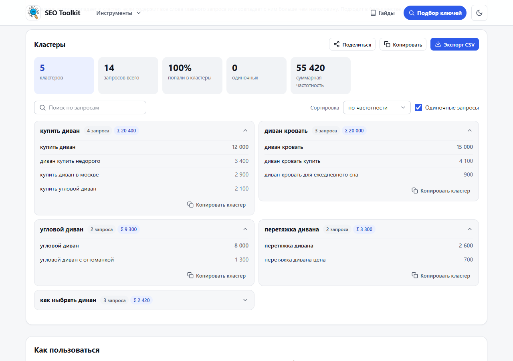
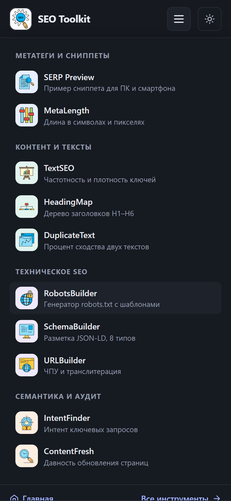

# SEO Toolkit

SEO-анализ сайта с оценкой из 100 и 12 бесплатных SEO-инструментов, которые работают прямо в браузере. Без регистрации,
API-ключей и базы данных — сайт собирается в статические файлы и размещается на Render Static Site.

**Сайт:** https://seotoolkitru.onrender.com

**Стек:** Vite + Vanilla JavaScript, HTML, CSS. Без фреймворков: все вычисления выполняются на стороне пользователя.
Внешние запросы: подсказки поисковиков для Keyword Finder (Google, YouTube и Bing — прямо из браузера, Яндекс — через
маленький сервер `server/`, потому что Яндекс не отдаёт подсказки браузеру с чужих сайтов) и SEO-анализ: тот же сервер
загружает проверяемую страницу, robots.txt и sitemap.xml, а проверки и оценка считаются в браузере.

**[SEO-анализ сайта](https://seotoolkitru.onrender.com/seo-audit)** — форма в самом верху главной: вводите адрес, получаете
оценку из 100, список того, что исправить в первую очередь, и инструменты SEO Toolkit, которые откроются уже с данными
страницы (Title и Description — в SERP Preview и MetaLength, заголовки — в HeadingMap, текст — в TextSEO, robots.txt —
в RobotsBuilder, адреса из sitemap.xml — в ContentFresh).

**Значок «SEO-оценка»** — в отчёте можно взять код значка с полученной оценкой для своего сайта: кнопка 88×31, плашка
180×50, медаль 150×150 и баннер 468×60 (HTML или Markdown). Значок ведёт на живую проверку сайта. Картинки —
`public/badge/<размер>/<оценка>.svg`, собираются командой `npm run badges` (SVG по 5–14 КБ). 3D-эмодзи кубка, медали,
графика и инструментов — [Microsoft Fluent Emoji](https://github.com/microsoft/fluentui-emoji), лицензия MIT
(`assets/fluent-emoji/LICENSE`).

**Главный инструмент — [Keyword Finder](https://seotoolkitru.onrender.com/keyword-finder):** подбор ключевых слов по подсказкам
поисковиков с примерной частотностью, сложностью, цветной оценкой потенциала и советами по каждой фразе. «Золотые» фразы
(быстрый потенциал и не больше трёх слов) подсвечены золотом и стоят первыми; галочками можно выбрать фразы, и копирование,
CSV, ссылка и передача возьмут только их. Выделен на главной
(отдельный блок и крупная карточка), в шапке (кнопка «Подбор ключей»), в меню и первым в блоке «Другие инструменты».


## Возможности

- 13 инструментов на отдельных страницах с понятными URL, общая навигация, хлебные крошки, страница 404.
- SEO-анализ сайта: около 30 проверок (индексация, сниппет, контент, техника, ссылки, разметка), оценка из 100 и план исправлений.
- Цепочка сбора семантики: Keyword Finder → IntentFinder → KeyCluster — результат передаётся в следующий инструмент одной кнопкой.
- Ссылки на результат: кнопка «Поделиться» в каждом инструменте сохраняет данные прямо в ссылке (после `#`, на сервер не уходят).
- Раздел [«Гайды»](https://seotoolkitru.onrender.com/guides) — пошаговые руководства по SEO со ссылками на инструменты.
- Светлая и тёмная тема, адаптивная вёрстка для компьютеров, планшетов и смартфонов.
- Копирование результатов в один клик, экспорт в CSV (UTF-8 для Excel), TXT, JSON и robots.txt.
- Загрузка CSV в UTF-8 и Windows-1251, обработка больших списков (50 000 запросов — меньше секунды).
- SEO самого сайта: Title и Description, canonical, Open Graph с картинками, JSON-LD (WebApplication, FAQPage, BreadcrumbList), sitemap.xml, robots.txt, IndexNow.

## Скриншоты

| SERP Preview | TextSEO |
| --- | --- |
|  |  |
| **SchemaBuilder (тёмная тема)** | **HeadingMap (тёмная тема)** |
|  |  |
| **IntentFinder** | **ContentFresh** |
|  |  |
| **KeyCluster** | **Гайд** |
|  |  |

<p>
  
  &nbsp;
  
</p>

## Инструменты

| URL | Инструмент | Что делает |
| --- | --- | --- |
| `/seo-audit` | **SEO-анализ сайта** | Проверка страницы по адресу: код ответа, редиректы, noindex, robots.txt, sitemap.xml, canonical, Title/Description, H1 и заголовки, объём текста, alt, HTTPS и сертификат, редирект с http, зеркало www, viewport, скорость ответа, сжатие, Schema.org, Open Graph; оценка из 100 и инструменты для исправления |
| `/keyword-finder` | **Keyword Finder** | Подбор ключей по подсказкам Google/Яндекса/YouTube/Bing, оценка частотности и сложности, цвета потенциала, советы по фразе, калибровка по Вордстату, CSV |
| `/serp-preview` | SERP Preview | Пример сниппета для ПК и смартфона, счётчики, предупреждения о длине |
| `/robots-builder` | RobotsBuilder | Генератор robots.txt: группы, Allow/Disallow, Sitemap, шаблоны, проверка, скачивание |
| `/text-seo` | TextSEO | Статистика текста, частота слов и фраз (1–4 слова), плотность ключей, повторы, CSV |
| `/heading-map` | HeadingMap | Дерево H1–H6 из HTML или текста, пропуски уровней, дубли, экспорт TXT/CSV |
| `/duplicate-text` | DuplicateText | Текстовое сходство двух текстов по словам, фрагментам и предложениям, подсветка |
| `/schema-builder` | SchemaBuilder | JSON-LD для 8 типов Schema.org, проверка, копирование, скачивание `.json` |
| `/url-builder` | URLBuilder | ЧПУ/slug с транслитерацией, массовая обработка, CSV |
| `/meta-length` | MetaLength | Длина Title/Description в символах и ≈пикселях, свои диапазоны, проверка списка/CSV |
| `/intent-finder` | IntentFinder | Классификация запросов по интенту по редактируемому словарю, фильтры, ручная правка |
| `/key-cluster` | KeyCluster | Кластеризация семантического ядра по составу слов: три силы группировки, учёт интента, суммарная частотность, CSV |
| `/content-fresh` | ContentFresh | Давность обновления страниц из CSV, периоды, свои пороги, список на обновление |

## Гайды

Статьи лежат в `content/guides/*.md` (Markdown с заголовком-frontmatter: title, h1, description, summary, date, updated,
tools, icon, order). При сборке плагин превращает каждую статью в страницу `/guides/<slug>` по шаблону `pages/guide.html`:
с оглавлением, разметкой `Article`, OG-картинкой (`npm run images`), ссылками на инструменты и записью в sitemap.xml.
Новый гайд — это новый `.md`-файл; после него выполните `npm run routes`, чтобы добавить правила в `render.yaml`.

## Запуск

Нужен Node.js 20.19+ (или 22.12+).

```bash
npm install
npm run dev        # http://localhost:5173
npm run build      # сборка в dist/
npm run preview    # проверка сборки: http://localhost:4173
npm test           # тесты Keyword Finder, сервера подсказок и SEO-анализа (node:test, без зависимостей)
```

## Домен сайта

Домен задаётся в одном месте — `site.config.js` (`url`). От него строятся canonical, Open Graph, `sitemap.xml` и `robots.txt`.
Его можно переопределить без правки кода переменной окружения при сборке: `SITE_URL=https://seo.example.com`.

## Публикация на Render

**Вариант 1 — Blueprint.** В Render: New → Blueprint → выберите репозиторий. Файл `render.yaml` создаст Static Site
с нужной командой сборки, папкой публикации, переменной `SITE_URL`, заголовками кеширования и правилами маршрутов.
Укажите в `SITE_URL` (в `render.yaml` или в настройках сервиса) фактический адрес сайта — Render может добавить к имени
суффикс, если имя сервиса уже занято (например, `имя-ab12.onrender.com`).

**Вариант 2 — вручную.** New → Static Site:

- Build Command: `npm ci && npm run build`
- Publish Directory: `dist`
- Environment: `SITE_URL=https://ваш-домен` (без слэша в конце)
- Redirects/Rewrites: по правилу Rewrite на каждую страницу — `/serp-preview` → `/serp-preview.html`
  и так же для остальных 10 адресов из таблицы выше.

**Сервер SEO-анализа (`server/audit.js`).** `POST /audit { url }` загружает страницу (до 3 МБ, до 5 редиректов),
robots.txt, sitemap.xml (первый файл индекса), проверяет редирект с http и зеркало www. Защита от SSRF: только http(s)
на портах 80/443 и только публичные IP — адрес проверяется при каждом соединении, в том числе после редиректов.
Лимиты: 30 проверок с одного IP и 600 всего за 10 минут, 6 одновременно. Ничего не сохраняется.

**Сервер подсказок Яндекса (`server/`).** Второй сервис в `render.yaml` — `seotoolkitru-api` (Node.js, бесплатный тариф,
без зависимостей). Если сервисы созданы через Blueprint, Render создаст его сам после пуша; иначе: New → Web Service →
этот репозиторий, Root Directory `server`, Build `npm install`, Start `node index.js`, Instance Type Free,
переменная `ALLOWED_ORIGINS=https://seotoolkitru.onrender.com`. Адрес сервиса укажите в `site.config.js` → `suggestApi`
(или переменной `SUGGEST_API_URL` при сборке сайта). Бесплатный сервис засыпает после 15 минут простоя, поэтому:
- с 07:00 до 01:00 по Москве его каждые 5 минут будит GitHub Actions (`.github/workflows/keep-api-awake.yml`;
  не круглосуточно — у бесплатных сервисов Render общий лимит 750 часов в месяц);
- любая страница сайта будит его запросом `/healthz` при открытии, чтобы к переходу в Keyword Finder он уже проснулся;
- если сервер так и не ответил, Keyword Finder считает частотность только по Google.

GitHub отключает расписание в публичном репозитории после 60 дней без коммитов — тогда включите его снова
на вкладке Actions.

Локально: `node server/index.js` (порт 8787) и сборка сайта с `SUGGEST_API_URL=http://localhost:8787`.

Render применяет правила, только если по пути нет файла, поэтому ассеты, `robots.txt` и `sitemap.xml` отдаются напрямую.
Не добавляйте редиректы вида `/serp-preview/` → `/serp-preview`: Render сопоставляет пути без учёта завершающего слэша,
и такое правило зацикливает страницу. Для несуществующих адресов Render сам отдаёт `404.html` с кодом 404.

## Структура

```
pages/                 HTML-страницы (контент инструментов); шапка, метатеги и подвал вставляются при сборке
plugins/site-plugin.js Vite-плагин: метатеги, меню, хлебные крошки, sitemap.xml, robots.txt, «чистые» URL в dev/preview
site.config.js         домен и название сайта
render.yaml            настройки Render: Static Site и сервер подсказок Яндекса
server/                посредник подсказок Яндекса для Keyword Finder (Node.js без зависимостей)
src/config/pages.js    конфигурация страниц: title, description, H1, категории
src/layout/            шаблоны шапки/подвала и SVG-иконки
src/core/              общие модули: DOM, тема, уведомления, буфер обмена, CSV, текст, даты, транслитерация
src/components/        переиспользуемые элементы: сниппет, переключатели, загрузка файлов, сортировка
src/tools/             логика каждого инструмента (+ schema/types.js, intent/dictionary.js,
                       keywords/ — подсказки, оценка частотности, сложность и советы Keyword Finder)
tests/                 тесты Keyword Finder (npm test)
src/styles/            токены и темы, раскладка, компоненты, стили инструментов
public/                иконки набора (icons/), OG-картинки (og/), favicon, иконки приложения
docs/screenshots/      скриншоты для README
scripts/               извлечение иконок, генерация картинок, IndexNow
```

Новый инструмент: добавьте запись в `src/config/pages.js`, файл `pages/<id>.html` и модуль `src/tools/<id>.js`,
затем правила маршрута в `render.yaml`. Меню, подвал, sitemap и перелинковка обновятся автоматически.

## SEO сайта

**Внутренняя оптимизация (генерируется при сборке):**

- уникальные Title и Description, один H1, canonical, `robots` с `max-image-preview:large`;
- Open Graph и Twitter Card с отдельной картинкой 1200×630 для каждой страницы (`public/og/`);
- JSON-LD: `WebSite` и `ItemList` на главной, `WebApplication`, `BreadcrumbList` и `FAQPage` на страницах инструментов,
  `Article` в гайдах и `CollectionPage` в разделе гайдов;
- текст об инструменте и блок «Частые вопросы» на каждой странице, перелинковка между инструментами;
- `sitemap.xml`, `robots.txt` с `Clean-param` для Яндекса, `llms.txt`, `site.webmanifest`, favicon и иконки приложения;
- заголовки безопасности и долгий кеш для ассетов (`render.yaml`).

**Внешняя оптимизация:**

1. Подтвердите права на сайт в [Google Search Console](https://search.google.com/search-console),
   [Яндекс Вебмастере](https://webmaster.yandex.ru) и [Bing Webmaster Tools](https://www.bing.com/webmasters):
   выберите подтверждение метатегом и вставьте код в `verification` в `site.config.js`, затем опубликуйте сайт.
2. Отправьте `https://seotoolkitru.onrender.com/sitemap.xml` в Search Console и Вебмастер.
3. После каждой публикации изменений запускайте `npm run indexnow` — адреса уйдут в Яндекс, Bing и другие
   поисковики с поддержкой IndexNow (ключ задан в `site.config.js`).

## Скрипты

```bash
npm run images     # OG-картинки, favicon и иконки manifest из SVG (public/)
npm run indexnow   # отправка адресов сайта по протоколу IndexNow
node scripts/extract-icons.mjs <набор.eps>   # извлечение иконок из EPS-набора в public/icons
```

## Иконки

Цветные иконки — набор «SEO Marketing Flat Line Icon Set» (автор rixwan), извлечены из EPS в SVG скриптом
`scripts/extract-icons.mjs`. Перед коммерческим использованием проверьте условия лицензии набора
(для бесплатных стоковых лицензий обычно требуется указание автора — оно есть в подвале сайта).
Мелкие интерфейсные значки (копировать, скачать и т. п.) — собственные монохромные SVG.

## Данные и приватность

На сайте установлен счётчик Яндекс Метрики (номер задаётся в `site.config.js` → `metrikaId`, код добавляется только
в продакшн-сборку). Счётчик запускается только после согласия на плашке cookie (`src/core/consent.js`); выбор можно
изменить кнопкой «Настройки cookie» в подвале, подробности — на странице `/privacy`. Рабочие области инструментов и уведомления помечены классами `ym-hide-content ym-disable-keys`,
поэтому Вебвизор не записывает введённые тексты, таблицы и результаты.

Все вычисления выполняются в браузере. Тексты, списки и файлы не отправляются на сервер. Keyword Finder отправляет введённые
фразы и их варианты в подсказки Google, YouTube и Bing (JSONP) прямо из браузера, а в Яндекс — через `server/`: посредник не
пишет фразы в журналы и не хранит их (только кэш в памяти до суток), IP нужен лишь для ограничения частоты. Это указано на
странице инструмента и в `/privacy`. В `localStorage` сохраняются только настройки (тема, режимы, диапазоны, пороги, словарь
интентов, настройки и калибровка Keyword Finder) и черновики RobotsBuilder, SchemaBuilder и SERP Preview.
CSV экспортируется в UTF-8 с BOM и разделителем `;` (корректно открывается в Excel с русской локалью); при загрузке
поддерживаются UTF-8 и Windows-1251.

## Ограничения

- Keyword Finder оценивает частотность по подсказкам Google и Яндекса, а не берёт её у поисковика: ошибка — в 2–5 раз, для
  точности есть калибровка по цифрам из Вордстата. Сложность — оценка по виду фразы, реальная выдача не проверяется. Если сервер
  подсказок Яндекса спит дольше минуты или недоступен, оценка строится только по Google (об этом пишет страница).
- Ширина в пикселях — оценка по шрифту Arial; реальное отображение зависит от поисковой системы и устройства.
- IntentFinder работает по словарю и простым правилам и не всегда точен; спорные запросы помечаются для ручной проверки.
- DuplicateText показывает вычисляемое сходство двух текстов, а не проверку на плагиат.
- KeyCluster группирует запросы по составу слов, а не по поисковой выдаче: синонимы попадают в разные кластеры, результат стоит просмотреть.
- Ссылки «Поделиться» с большими результатами (сотни фраз) получаются длинными — некоторые мессенджеры их обрезают.
- Режим «словоформ» в TextSEO использует упрощённое выделение основы и может ошибаться.
- Сайты по URL загружает только SEO-анализ (через `server/`); в остальных инструментах HTML и таблицы пользователь вставляет сам.
- SEO-анализ видит HTML без выполнения JavaScript и проверяет одну страницу, а не весь сайт; время ответа меряется
  с сервера Render в США. Это экспресс-проверка, а не замена Вебмастеру и Search Console.
